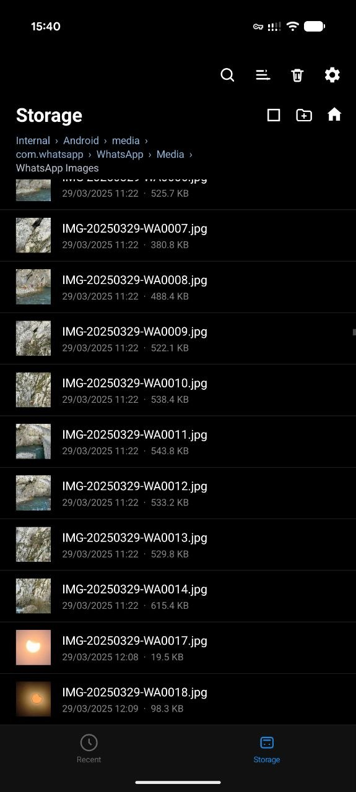
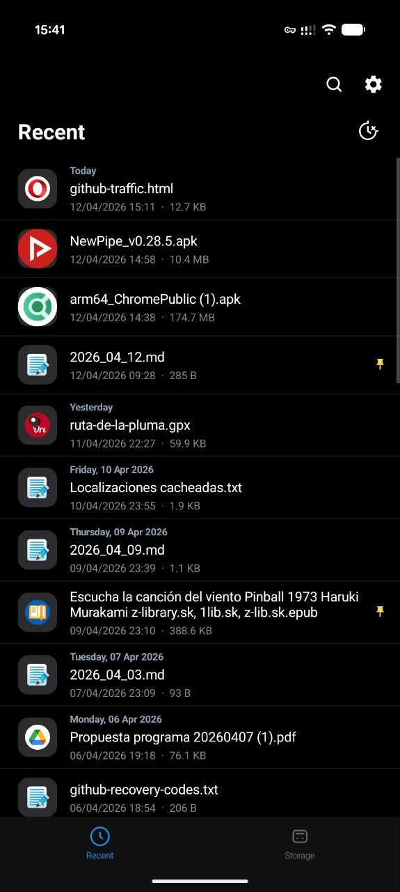
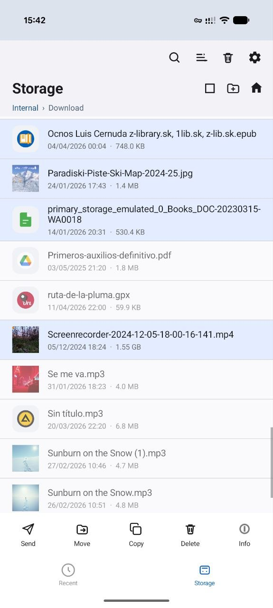
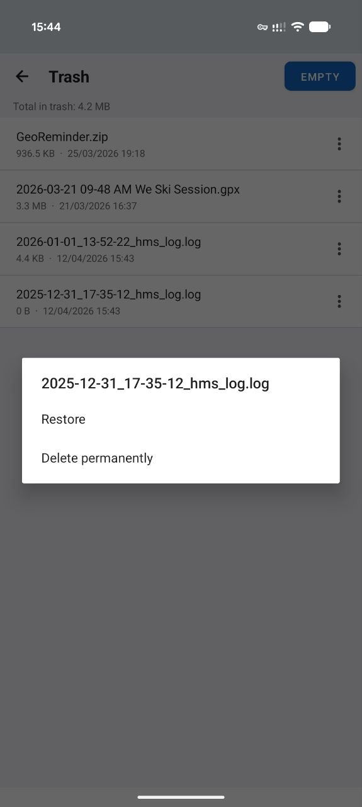
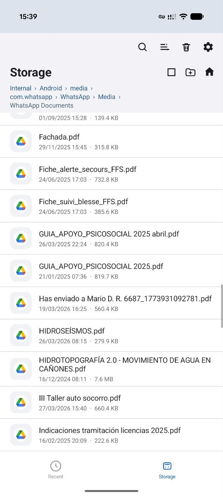
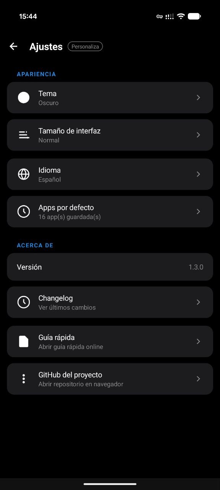
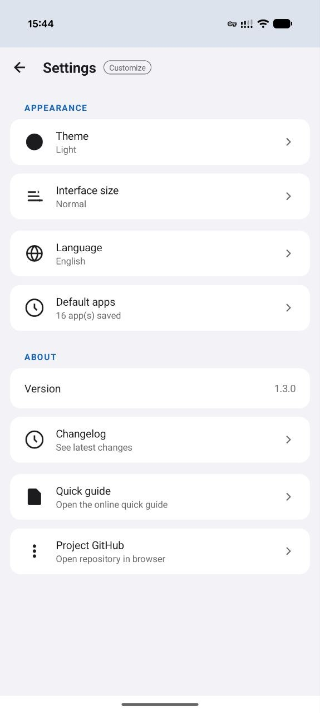

# GestorArchivos / FileManager

> Un gestor de archivos Android limpio y ligero, con papelera, previsualizaciones enriquecidas, archivos recientes e interfaz bilingüe.

[](https://github.com/fraugz/FileManager/releases/latest)
[](https://github.com/fraugz/FileManager/releases/latest)
[](LICENSE)
[](https://github.com/fraugz/FileManager/search?l=java)

---

| Idioma   | Documento |
|----------|-----------|
| English  | [README.md](README.md) |
| Español  | [README.es.md](README.es.md) |

---

## Capturas de pantalla

<p align="center">
  
  
  
  
  
</p>
<p align="center">
  
  
</p>

---

## Funcionalidades

- 📁 Navegación por carpetas con breadcrumb y acceso directo al inicio
- 🕐 Archivos recientes ordenados por fecha de acceso, con separadores de día y soporte de anclaje
- ☑️ Selección múltiple con acciones de copiar, mover, compartir, eliminar e información
- 🗑️ Papelera con restauración y eliminación permanente
- 🖼️ Previsualizaciones enriquecidas: miniaturas de imágenes, fotogramas de vídeo, portadas de audio, iconos de APK
- 🔍 Búsqueda incremental con cancelación
- 📤 Destino de compartir: recibe archivos de otras apps y guárdalos en cualquier carpeta
- 🎨 Ajustes de apariencia: tema oscuro/claro, escala de interfaz (4 tamaños), idioma
- 🌐 Soporte bilingüe completo: español e inglés
- 📱 Android 7.0 mínimo (API 24)

---

## Descarga

**[⬇️ Descargar último APK](https://github.com/fraugz/FileManager/releases/latest)**

> Envío a F-Droid planificado.

---

## Documentación

| Documento | Descripción |
|-----------|-------------|
| [Guía Rápida](QUICK_GUIDE.es.md) | Tareas comunes y consejos para usuarios |
| [Quick Guide (EN)](QUICK_GUIDE.md) | Common tasks and tips (English) |
| [Guía de Desarrollo](DEVELOPMENT.es.md) | Arquitectura, comportamiento, changelog, testing, problemas comunes |
| [Development Guide (EN)](DEVELOPMENT.md) | Same content in English |

---

## Compilar desde el código fuente

### Android Studio (recomendado)

1. Clona el repositorio.
2. Abre el proyecto en Android Studio.
3. Espera a que Gradle sincronice.
4. Ejecuta en un dispositivo o emulador (API 24+).

### Línea de comandos

> **Nota:** Este repositorio no incluye el wrapper de Gradle (`gradlew`/`gradlew.bat`). Usa una instalación local de Gradle o genera los archivos del wrapper.

```bash
gradle :app:assembleDebug
```

Salida: `app/build/outputs/apk/debug/app-debug.apk`

**Requisitos:** Android Studio, JDK compatible con AGP, Android SDK 34.

---

## Feedback y comunidad

¿Encontraste un bug o tienes una idea? Hay tres formas de contactar:

- 🐛 **Bug o crash** → [Abre un Issue](https://github.com/fraugz/FileManager/issues) con los pasos para reproducirlo
- 💡 **Ideas o preguntas** → [Únete a las Discussions](https://github.com/fraugz/FileManager/discussions)
- 📬 **Contacto directo** → [satin-speed-friday@duck.com](mailto:satin-speed-friday@duck.com)

Todo el feedback es bienvenido — el proyecto está en desarrollo activo.

---

## Versiones & changelog

- **v1.3.2** — Corrección crítica: los archivos ahora se mueven correctamente a la papelera en lugar de eliminarse. Selección múltiple corregida. Soporte de selección múltiple en la pantalla de papelera. Miniaturas de media usando el nombre original. Las carpetas visitadas aparecen en Recientes.
- **v1.3.1** — Papelera rediseñada con miniaturas, apertura por tap, barra de acciones por pulsación larga, secciones siempre visibles, confirmación conjunta al vaciar, cuenta atrás de auto-eliminación.
- **v1.3.0** — Recientes rediseñado con selección, Localizar, Fijar, separadores de día, conservar anclados al limpiar, encabezado de Almacenamiento compactado, breadcrumb de ancho completo, envío de carpetas, guardado de texto compartido.
- **v1.2.9** — Nombre de app localizado por idioma, selector Abrir ampliado, acción Info para elemento único (incluye carpetas), Renombrar oculto en multiselección, enlaces a guía rápida y GitHub en Ajustes.
- **v1.2.8** — Nombres de playlist más descriptivos, importar desde hoja de compartir (Guardar aquí), archivos movidos se eliminan de Recientes.
- **v1.2.7** — Ajustes de UX en app por defecto y barra de selección.
- **v1.2.6** — Playlists multiarchivo, seleccionar todo, etiqueta dinámica Mover/Pegar, barra de progreso, cancelación real, confirmación de eliminar definitivamente.
- **v1.2.5** — Acción directa de app por defecto, selector de apps buscable, previsualizaciones enriquecidas (audio/vídeo/APK).
- **v1.2.0–v1.2.4** — Interfaz bilingüe, selector de idioma, correcciones de estabilidad y mejoras incrementales de UX.
- **v1.1.0** — Cambio de branding y paquete.
- **v1.0.0** — Baseline inicial.

---

## Hoja de ruta

- Migración a Storage Access Framework para mejor compatibilidad con Android 11+
- Vista dual: lista y cuadrícula con ordenación persistente
- Previsualizaciones en la propia app (PDF, vídeo, texto)
- Favoritos y colecciones inteligentes (Descargas, Imágenes, Documentos)
- Tests de UI instrumentados para flujos críticos
- Mejora de accesibilidad: descripciones de contenido, contraste, navegación por teclado

---

## Contribuir

- Abre un issue con contexto y pasos de reproducción
- Una rama por función o corrección
- Commits pequeños y enfocados
- Incluye capturas para cambios visuales
- Describe cómo validaste los cambios antes de abrir un PR

Para detalles técnicos e información de desarrollo, consulta **[DEVELOPMENT.es.md](DEVELOPMENT.es.md)**.

---

## Licencia

Distribuido bajo la licencia MIT. Consulta [LICENSE](LICENSE) para más detalles.
